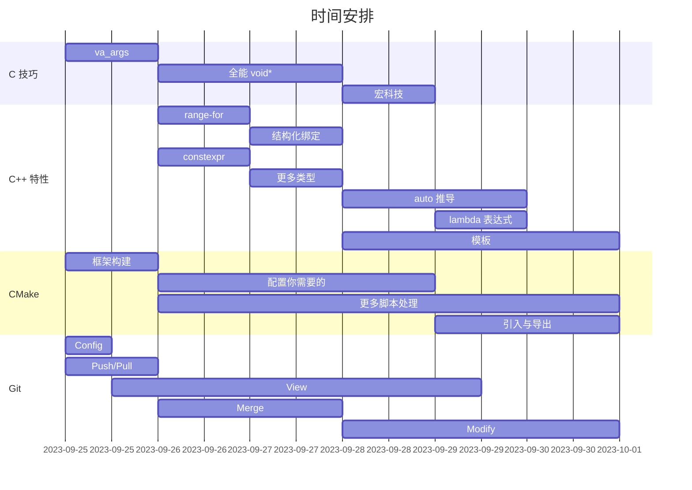

# 写在前头

本计划的目的在于快速抬高软件新人的工程能力及推动编程能力的现代化。

# 第一阶段

主要目标：

- 工程 C 认知跟进
- Modern C++ 认知跟进
- Git 日常化
- CMake 日常化

## 第一周

> C 技巧 - va_args

学习 C 标准库 stdarg.h 的相关知识，知晓 va_list 结构以及 va_start、va_arg、va_end 三个宏的用法及功能。

主要任务：

1. 利用 stdarg.h 自行实现任意的变参函数。
2. 了解标准库 stdio.h 中 printf 系列的函数，并利用 vprintf 自行实现变参函数 print，该函数的功能应与 printf 完全一致。
3. 考虑使用 stdarg.h 中可能出现的不安全的情况，并说明错误地指定 va_arg 所要获取的类型会导致什么后果。

> C 技巧 - 全能 void*

主要任务：

1. 实现 int/int\*/const int*/int \*const/T*/T\*const\* 与 void* 之间的相互转换（T 的定义为 `struct T {};`）。
2. 掌握函数指针类型的编写规则，至少掌握到二层嵌套的函数指针类型（即包含返回值或传参为函数指针的函数指针类型）。
3. 实现任意函数指针到 void* 的转换。
4. 编写函数 `void f(int, void*, ...)`，使其支持根据 int 参数的不同至少将 void* 解释为忽略、基本类型、自定义数据类型、函数指针四种实际类型并各自实现对应的功能。
5. 考虑 C++ 代码 `struct T { void foo(); void bar() const; };`，判断 &T::foo 的类型 `void(T::*)()` 与 &T::bar 的类型 `void(T::*)() const` 是否可以相互转换，并尝试实现其与 void* 之间的相互转换。
6. \[选做] 了解 C++ OOP 中的虚表是什么，并尝试在 C 中利用函数指针实现手写虚表。

> C 技巧 - 宏科技

掌握自定义宏的编写。

主要任务：

1. 了解编译器的内置宏变量。
2. 了解宏各项展开的优先级。
3. 编写统计参数个数的变参宏，最大可统计的个数自行决定。
4. 编写变参宏，使其能够根据参数个数的不同实现不同的功能，宏的功能自行决定。

> C++ 特性 - range-for

了解并掌握 C++ 特性 range-based for loops。

主要任务：

1. 尝试使用 range-for 遍历任意标准库容器。
2. 了解迭代器的概念及其基本接口，并为自定义类型实现单向顺序访问可读写的迭代器。
3. 了解并说明迭代器失效的概念及相关危险操作。
4. 了解自己当前使用的编译器的标准库对 range-for 的具体实现，并说明对于该种实现，应当确保使用的迭代器类型应该至少满足何种条件才能使 range-for 按照预期正常工作。
5. 了解循环变量的不同类型限定符对采用的迭代器类型的影响。

> C++ 特性 - 结构化绑定

主要任务：

1. 了解结构化绑定的基本语法及适用条件。
2. 了解标准库 utility 中的 std::pair 及 tuple 中的 std::tuple，并尝试对其应用结构化绑定。
3. 尝试使用构造函数或初始化列表构造结构化绑定，说明其与等号复制构造的区别，并为自定义类型编写合适的构造函数使其在使用两种构造方法时表现出不同的行为。

> C++ 特性 - constexpr

主要任务：

1. 了解 constexpr 的作用，并说明其与 const 限定符的共同作用及差异。
2. 了解 constexpr 在 C++11 及 C++17 中的差别。
3. 了解 if-constexpr，尝试编写样例代码并说明其作用。
4. 编写 constexpr 方法，并说明其在各种形式的传参（编译期，运行时）下的实际执行代码。
5. 编写自定义类型及关联构造函数，使其能够成为编译期对象。

> C++ 特性 - 更多类型

主要内容：

1. 了解标准库 string_view 下的 std::string_view，说明其与 std::string 和 char* 各自应该在什么情境下使用，并简单编写示例程序进行应用。
2. 了解标准库 any 下的 std::any，自行搜索相关文档了解 std::any 的实现原理，并编写简单示例程序使 std::any 赋值不同类型的数据并分别用安全与不安全的方式获取 std::any 的当前值。
3. 了解标准库 optional 下的 std::optional，编写简单程序进行应用。
4. 了解标准库 variant 下的 std::variant，说明其相对于传统 union 结构的优越性；了解其构造函数的调用规则，自行进行实验查看 std::variant 在特例下的实际存储类型与模板参数类型的差异。
5. 了解标准库 functional 下的 std::function，学习使用 std::bind、std::apply、std::invoke 等相关用法并给出示例程序。

> C++ 特性 - auto 推导

主要内容：

1. 了解 auto 与 decltype 关键字，并说明二者的差异性以及其各自具体的类型推导规则。
2. 了解 decltype(auto) 的用法并说明何时应该采用该种写法，并实践说明是否存在 auto 的替代写法。
3. 思考 auto 关键字是否是结构化绑定的固定语法。
4. 思考 auto 关键字在模板参数列表中的使用。

> C++ 特性 - lambda 表达式

主要内容：

1. 了解 lambda 的基本语法并了解值捕获、引用捕获、this 指针捕获的用法，查阅文档或自行实验了解各捕获方式在捕获列表中顺序。
2. 了解闭包的概念并使用 lambda 表达式实现 y 算子（自行了解相关概念）。
3. 了解 lambda 表达式在编译器中的具体实现，并思考关键过程内编写 lambda 表达式的效率问题。
4. 了解仿函数的概念，并自行实现一个“仿函数”。
5. 说明 lambda 表达式与仿函数的关系，并思考应当使用什么类型来传参任意类型的函数调用（如函数指针、lambda 表达式、自定义仿函数）。

> C++ 特性 - 模板

以 C++17 为标准简单了解模板的常用用法。

主要内容：

1. 了解模板的声明、实现、使用与特化，说明模板可以应用于哪些语法单元，编写模板特化与偏特化，并说明偏特化不能用于哪些语法单元。
2. 了解模板在模板参数列表中的嵌套用法（不需要给出样例实现，能看懂就行）。
3. 编写实例，了解模板类型中何时可以省略当前类型的模板参数，什么时候必须指定参数。
4. 思考模板标识符的二义性与 typename 在模板中的用法。
5. 了解模板的变长参数，将其应用于函数参数中并体会模板参数折叠展开的逻辑。
6. 在模板参数列表中混用类型参数与值参数，并尝试说明是否存在方法能够实现通用变长模板参数（即参数中即有类型参数又有值参数，且参数总数不定）（该任务较难，可以学习完剩余的模板内容后再尝试操作，不作硬性要求）。
7. 了解模板的 SFINAE 机制并简单了解标准库 type_traits 下的 std::enable_if_t 在模板中的用法，说明  std::enable_if_t 是如何使 SFINAE 生效的。
8. 明确 SFINAE 生效于模板体中所使用参数中的最内层模板，自行了解标准库 utility 下的 std::declval，运用 SFINAE 机制、函数重载决议（自行了解）实现功能：判断类型中是否包含 `void foo(int)` 的成员函数。

> 抓住 SFINAE 核心：若被测试的模板代码段在模板参数替换之后会产生语法/语义错误，则跳过该模板去寻找下一个待测试单元。

> CMake - 框架构建

主要任务：

1. 学习如何编写最小化的将 main.cpp 编译到可执行程序或静态库或动态链接库的 CMakeLists.txt 脚本。
2. 学习 CMake 命令行，知晓以下配置：
    - 默认配置目录及如何指定根 CMakeLists.txt 的所在目录。
    - 默认构建目录及如何指定 CMake 的目标构建目录。
    - 默认使用的编译后端及如何查看可选的后端及如何指定当前项目 CMake 使用的编译后端。
    - 如何向 CMake/CMakeLists.txt 传递自定义变量。
    - 如何使用 --build 与 --target 选项。
3. 进行实验并说明何种情况下，必须清除已经存在目标构建目录并使用 CMake 重新进行项目的配置生成新的构建目录。
4. 查阅[官方文档](https://cmake.org/cmake/help/latest/manual/cmake-variables.7.html)并了解 CMake 常用内置变量及其作用。
5. 使用 CMake 管理当前计划的所有内容，并尽可能精简 CMakeLists.txt 文件数目及内容大小。

> CMake - 配置你需要的

> CMake - 更多脚本处理

> CMake - 引入与导出

> Git - Config

主要内容：

1. 自行注册 GitHub 账号并加入[鱼组组织](https://github.com/NWPU-SRB-FishGroup)。
2. 了解 SSH 并为 GitHub 配置 SSH Key 用于鉴权，详见 [[SSH key 配置]]。
3. 了解 GPG 并为 GitHub 配置 GPG Key 用于签名，详见 [[GPG key 配置]]。
4. 了解 Git 的 config 子命令，在全局配置 git 将使用的 name、email，并查询相关资料，根据 GPG 配置过程给出的相关信息，为 git 配置为每次提交自动签名。
5. 自行在本地创建仓库并了解 add 与 commit 子命令，将计划的所有内容都有条理地提交到仓库中。

> Git - Push/Pull

主要内容：

> Git - View

> Git - Merge

> Git - Modify
